# Active Directory Home Lab — Domain Setup & User Management

**Environment:** VMware Workstation · Windows Server 2022 (Evaluation) · Domain: `pinnaclesolutions.local`

Built a fully functional Active Directory environment from scratch — domain controller, organizational unit structure, security groups, distribution groups, and 15 user accounts across five departments. Then ran through the daily help desk tasks that make up most of an IT support role: password resets, account lockouts, employee offboarding, new hire onboarding, and shared folder permissions.

**Scenario:** Pinnacle Solutions — a 50-person professional services firm based in Dallas, TX.

---

## Organizational Unit Structure

The OU structure follows how most mid-size companies organize Active Directory — geography first, then departments, then asset types.

```
pinnaclesolutions.local
│
├── Dallas
│   ├── Computers
│   │   ├── Laptops
│   │   └── Workstations
│   ├── Servers
│   ├── Service Accounts
│   └── Users
│       ├── Finance
│       ├── Human Resources
│       ├── IT Department
│       ├── Operations
│       └── Sales
│
├── Disabled Accounts
│
└── Shared Resources
    ├── Distribution Lists
    └── Printers
```

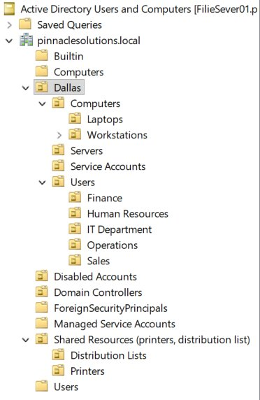

**Why it's structured this way:**

- **Geographic OU at the top** — if the company opens a second office, you add another location OU at the same level. GPOs and delegation stay clean.
- **Users split by department** — each department OU lets you apply different Group Policies. Finance might need a shorter screen lock timeout. Sales might need a mapped drive to the proposals folder.
- **Computers split by type** — laptops and workstations often need different GPOs. Laptops might get a VPN auto-connect policy. Workstations might get a power management policy.
- **Disabled Accounts OU** — when someone leaves, you don't delete their account. You disable it, strip group memberships, and move it here. The account stays for audit purposes.
- **Service Accounts OU** — non-human accounts used by applications. Separated so they don't get hit with GPOs meant for people, like password expiration policies.

---

## Security Groups & Distribution Groups

**Security groups** control access — who can open what folders, who can RDP into servers, who can use VPN. You assign permissions to a group, then manage people in and out. When someone joins or leaves a department, you change their group membership. You never touch the resource permissions.

| Group Name | Type | Purpose |
|---|---|---|
| SG-IT | Security | IT department access rights |
| SG-HR | Security | HR department access rights |
| SG-Finance | Security | Finance department access rights |
| SG-Sales | Security | Sales department access rights |
| SG-Operations | Security | Operations department access rights |
| SG-DomainAdmins-Custom | Security | Elevated IT admin rights (separate from built-in Domain Admins) |
| SG-VPN-Users | Security | Users approved for VPN access |
| SG-RemoteDesktop-Users | Security | Users approved for RDP access to servers |

**Distribution groups** are email lists. They don't control access. Send one message to DL-AllEmployees instead of typing 50 addresses.

| Group Name | Type | Purpose |
|---|---|---|
| DL-AllEmployees | Distribution | Company-wide email list |
| DL-IT-Team | Distribution | IT team email list |
| DL-Managers | Distribution | All department managers |
| DL-Finance-Team | Distribution | Finance department email list |

---

## User Accounts

15 accounts across five departments. Naming convention: first initial + last name (e.g., `jmartin`) — the most common format in production environments.

### IT Department

| Name | Logon | Title | Security Groups | Distribution Groups |
|---|---|---|---|---|
| James Martin | jmartin | IT Manager | SG-IT, SG-DomainAdmins-Custom, SG-VPN-Users, SG-RemoteDesktop-Users | DL-AllEmployees, DL-IT-Team, DL-Managers |
| Priya Desai | pdesai | IT Support Specialist | SG-IT, SG-VPN-Users, SG-RemoteDesktop-Users | DL-AllEmployees, DL-IT-Team |
| Marcus Cole | mcole | IT Support Technician | SG-IT, SG-VPN-Users | DL-AllEmployees, DL-IT-Team |

### Human Resources

| Name | Logon | Title | Security Groups | Distribution Groups |
|---|---|---|---|---|
| Angela Torres | atorres | HR Director | SG-HR, SG-VPN-Users | DL-AllEmployees, DL-Managers |
| David Nguyen | dnguyen | HR Coordinator | SG-HR | DL-AllEmployees |
| Lisa Okafor | lokafor | Recruiter | SG-HR | DL-AllEmployees |

### Finance

| Name | Logon | Title | Security Groups | Distribution Groups |
|---|---|---|---|---|
| Robert Chen | rchen | Finance Director | SG-Finance, SG-VPN-Users | DL-AllEmployees, DL-Finance-Team, DL-Managers |
| Karen Mitchell | kmitchell | Senior Accountant | SG-Finance | DL-AllEmployees, DL-Finance-Team |
| Tyler Brooks | tbrooks | Accounts Payable Specialist | SG-Finance | DL-AllEmployees, DL-Finance-Team |

### Sales

| Name | Logon | Title | Security Groups | Distribution Groups |
|---|---|---|---|---|
| Samantha Reyes | sreyes | Sales Manager | SG-Sales, SG-VPN-Users | DL-AllEmployees, DL-Managers |
| Jamal Henderson | jhenderson | Account Executive | SG-Sales, SG-VPN-Users | DL-AllEmployees |
| Emily Tran | etran | Sales Coordinator | SG-Sales | DL-AllEmployees |

### Operations

| Name | Logon | Title | Security Groups | Distribution Groups |
|---|---|---|---|---|
| Derek Washington | dwashington | Operations Manager | SG-Operations, SG-VPN-Users | DL-AllEmployees, DL-Managers |
| Maria Santos | msantos | Operations Coordinator | SG-Operations | DL-AllEmployees |
| Brian Kelly | bkelly | Facilities Coordinator | SG-Operations | DL-AllEmployees |

**User properties — Robert Chen (Finance Director):**

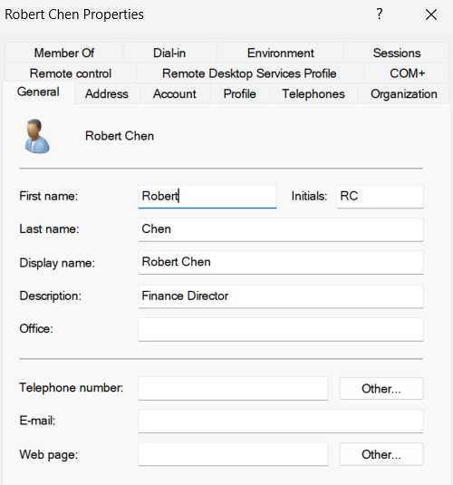

**Group memberships — Angela Torres (HR Director):**

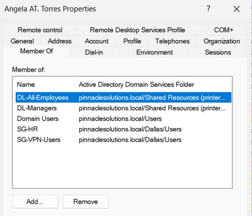

### Verification

**DL-AllEmployees** — all 15 users correctly assigned to the company-wide distribution group:

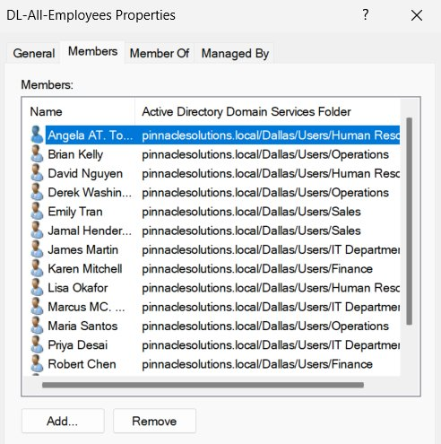

**SG-VPN-Users** — 8 users with VPN access (managers, directors, field sales, and IT staff):

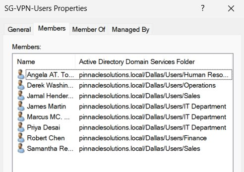

---

## Help Desk Practice Tasks

### Password Reset

**Scenario:** Jamal Henderson (`jhenderson`) forgot his password and submitted a ticket.

**Steps:**
1. Open Active Directory Users and Computers → Dallas → Users → Sales
2. Right-click jhenderson → Reset Password
3. Set a temporary password
4. Check "User must change password at next logon"

You never set a permanent password for someone. The temporary password gets them in, then they're forced to create their own. This keeps IT from knowing anyone's actual password — which matters for security and liability.

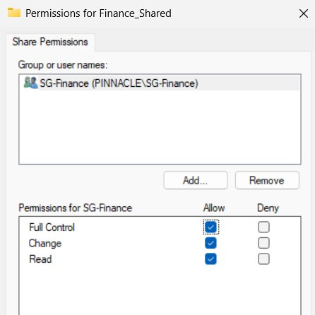

---

### Employee Offboarding

**Scenario:** Tyler Brooks (`tbrooks`) is leaving the company.

This is a multi-step process — disable the account, strip all group memberships, then move it to the Disabled Accounts OU. You don't delete it. The account stays for audit purposes, and managers might need access to files Tyler owned.

**Step 1 — Disable the account:**

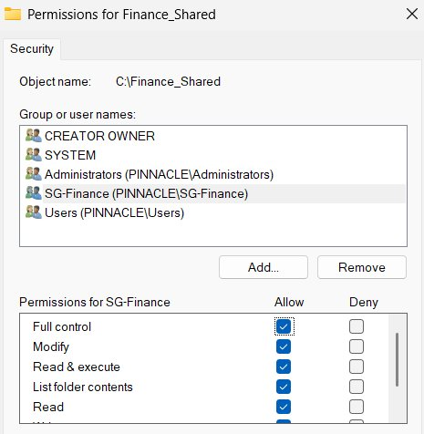

**Step 2 — Remove all group memberships** (except Domain Users, which can't be removed):

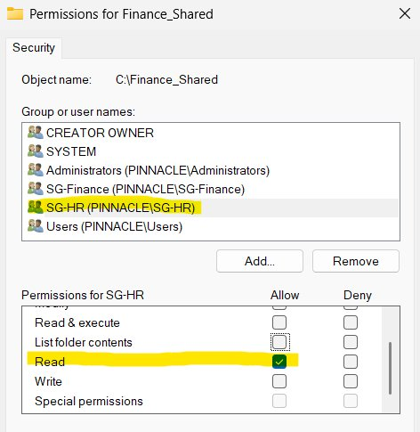

**Step 3 — Move to Disabled Accounts OU:**

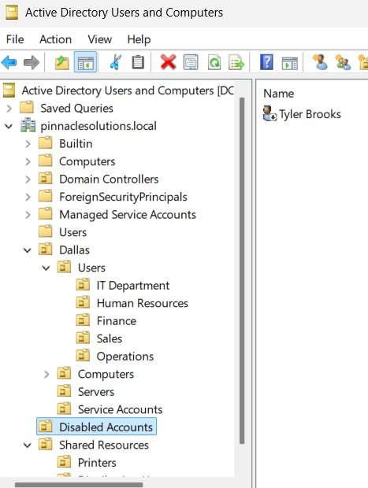

---

### Shared Folder Permissions

**Scenario:** Create a shared Finance folder. Finance gets full control, HR gets read-only access for viewing financial reports, everyone else gets nothing.

Windows uses two layers of permissions. Share permissions apply when accessing over the network. NTFS (Security) permissions apply always — local and network. The effective permission is whichever is more restrictive. You set both to make sure no one gets access through one layer that the other was supposed to block.

**Share permissions — SG-Finance with Full Control:**

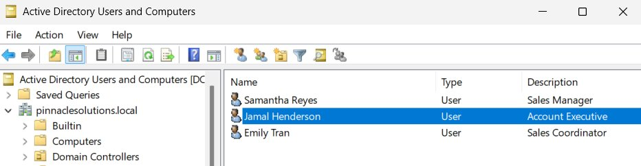

**NTFS permissions — SG-Finance with Full Control:**

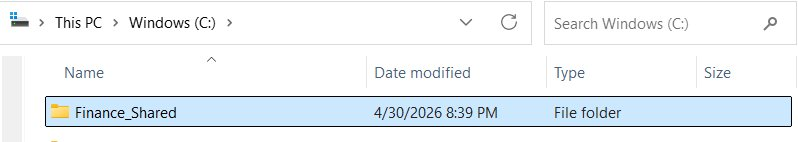

---

## Tools Used

- Windows Server 2022 (Evaluation)
- Active Directory Domain Services (AD DS)
- Active Directory Users and Computers (ADUC)
- Event Viewer
- VMware Workstation
